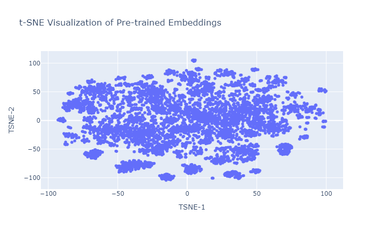
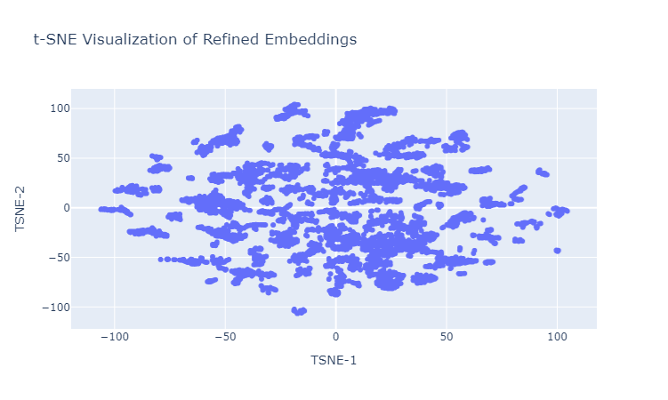
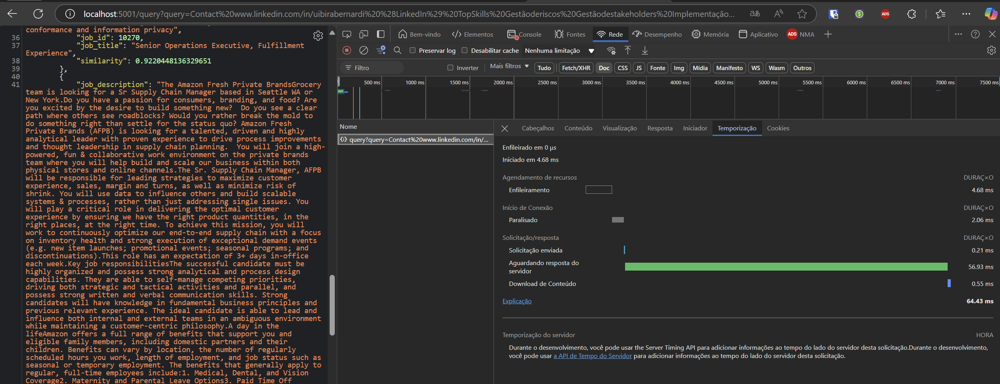

# aps-2-nlp


## Step 1: find embeddings

* **A description of your dataset**

    The dataset comprises job listings from multiple companies, including titles, locations, descriptions, and URLs for each listing. Each entry represents a unique job, with fields that store essential details about the position.

* **A description of the process to generate embeddings, including the neural network topology and hyperparameters**
    
    We used OpenAI's text-embedding-3-large model to generate embeddings for job postings. Each job title and description became a 3072-dimensional vector. We then designed a denoising autoencoder, where the encoder reduces the input size from 3072 to 512 through layers of sizes 2048, 1024, and 512. The decoder reconstructs the original size through layers of sizes 1024, 2048, and 3072.

    ### Neural Network Topology

    ```mermaid
    flowchart LR
    Input["3072 - Input Layer"]
    E1["2048"]
    E2["1024"]
    Latent["512 - Latent Space"]
    D1["1024"]
    D2["2048"]
    Output["3072 - Output Layer"]

    Input --> E1 --> E2 --> Latent
    Latent --> D1 --> D2 --> Output

    ```
    ### Hyperparameters

    - **Input Size**: 3072
    - **Encoder Layer Sizes**: [3072, 2048, 1024, 512]
    - **Decoder Layer Sizes**: [512, 1024, 2048, 3072]
    - **Activation Function**: ReLU for each layer except the output layer
    - **Loss Function**: Mean Squared Error (MSE), as it’s typical for reconstruction tasks
    - **Optimizer**: Adam optimizer with:
    - **Learning rate (`lr`)**: $(1 \times 10^{-3})$


* **A description of the training process, including a description of the loss function and why it makes sense to your problem**

    We trained a denoising autoencoder to reconstruct original embeddings from corrupted inputs, using Gaussian noise to create these inputs. The Mean Squared Error (MSE) loss function, defined as

    $$\mathcal{L} = \frac{1}{n} \sum_{i=1}^{n} (X_i - \hat{X}_i)^2$$


    encourages the model to capture essential features and reduce noise. This approach refined pre-trained embeddings to our dataset, enhancing relevance by focusing on significant features.


## Step 2: visualize your embeddings

* **Figures showing the embeddings for pre-trained and tuned embeddings**

    
    Figure 1: t-SNE visualization of pre-trained embeddings


    
    Figure 2: t-SNE visualization of refined embeddings

* **Discussion on what can be seen in each figure, clusters and so on**

    In Figure 1, the t-SNE visualization of pre-trained embeddings shows a dispersed distribution of data points, suggesting limited clustering in terms of job title and description similarity. This spread indicates that the pre-trained embeddings may not capture the nuances of job-specific information effectively. In Figure 2, however, the refined embeddings present a more structured layout with visible clusters, implying that similar job titles and descriptions are now closer together.

    This clustering suggests that the refinement process has improved the embeddings' ability to differentiate and group similar job-related terms, making it more effective for categorizing or matching roles based on their job postings, for example.

## Step 3: test the search system

* **Results for the three tests (test that yields 10 results, test that yields less than 10 results, test that yields something non-obvious)**

    ### Test that yields 10 results
    Resume: Davi Reis - Sr Developer
    Total Jobs: 10 results
    Best Job: Tririga Infrastructure Engineer, Close Systems (Relevance: 0.970)

    ### Test that yields less than 10 results
    Resume: Bob Miller - Recruiter
    Total Jobs: 9 results
    Best Job: Account Manager, Amazon Shipping (Relevance: 0.858)

    ### Test that yields something non-obvious
    Resume: Uibira Bernardi - Supply Chain
    Total Jobs: 10 results
    Best Job: Sr. Technical Vehicle Expert, Fixed Term Contract (FTC), Vehicle Change ManagementAutomation (Relevance: 0.936)

## Step 4: make it nicer!

### MLOPs Specialist:

We improved the speed by moving model and data loading outside the function (to load in memory, not in each request) and caching OpenAI request. Additionally, we implemented FAISS for faster similarity search. Finally, wee create a pipeline that updates all job data and embeddings when git pull on the server (setup_git_hook.sh and run_pipeline.sh) and, if the model is updated, it will be retrained.


Figure 3: Time of response